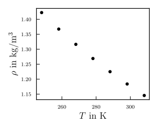
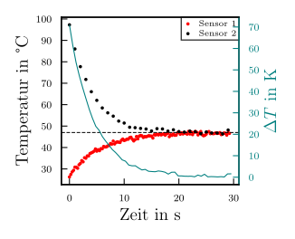

#Julius war da
# Beleg 1 - Interpolation

## Aufgabe 1
Die Dichte von gasförmiger Luft verändert sich annähernd linear mit steigender oder fallender Temperatur. Der gegebene Zusammenhang ist für einige Temperaturwerte in folgender Abbildung dargestellt und tabelliert:

| *T* in K | *&#961;* in kg m-3 | 
| ---    | ---   |
| 308,15 | 1,146 | 
| 298,15 | 1,184 | 
| 288,15 | 1,225 | 
| 278,15 | 1,269 | 
| 268,15 | 1,316 | 
| 258,15 | 1,367 | 
| 248,15 | 1,422 |

Sind Informationen zur Dichte erforderlich an Stellen zu denen kein Datenpunkt gegeben ist, kann der fehlende Wert mittels Interpolation bestimmt werden.

### Teilaufgaben:
  1. Erstellen Sie eine Funktion, mit deren Hilfe ein beliebiger Wert zwischen zwei Stützstellen linear interpoliert werden kann.
  2. Interpolieren Sie mit dieser Funktion die Dichte bei *T* = 260 K, *T* = 280 K und *T* = 300 K. Nutzen Sie dazu den kleinsten (*T* = 248,15 K) und größten (*T* = 308,15 K) gegebenen Wert als Stützstelle. Visualisieren Sie die Stützstellen, die Gerade zwischen den Stützstellen und die interpolierten Wertepaare in einem Diagramm.
  3. Implementieren Sie eine Funktion zur Nearest-Neighbour Interpolation und approximieren Sie mit dieser die in Teilaufgabe 2 gesuchten Dichten. Stellen Sie die Ergebnisse aus Teilaufgabe 2 und 3 in einer Tabelle gegenüber.
  4. Erweitern Sie die Funktion zur linearen Interpolation aus Teilaufgabe 1, sodass für einen gesuchten Punkt immer zwischen den beiden benachbarten gegebenen Stützstellen interpoliert wird.
  5. Die Dichte eines idealen Gases kann aus der thermischen Zustandsgleichung idealer Gase berechnet werden: 
 mit dem Druck *p*, dem Volumen *V*, der Masse *m*, der spezifischen Gaskonstante für Luft *R*S = 287,058 J kg−1 K−1 und der Temperatur *T*. Bestimmen Sie die Abweichung der Ergebnisse der beiden Interpolationsverfahren aus Teilaufgabe 3 und 4 zu mindestens 10 gleichmäßig verteilten Temperaturwerten (unter Normdruck: 1013,25 mbar) und tragen Sie diese in einem gemeinsamen Diagramm auf.

## Aufgabe 2
Die beiden Dateien ``sensor_1.csv`` und ``sensor_2.csv`` enthalten zeitlich aufgelöste Temperaturdaten zweier Sensoren. Für die weitere Verarbeitung der Daten ist es erforderlich die Temperaturdifferenz zu bestimmen. Dies ist jedoch nicht ohne weiteres möglich, da beide Sensoren mit einer unterschiedlichen Aufnahmerate Daten speichern. Sensor 1 arbeitet mit einer Frequenz von 4 Hz wohingegen Sensor 2 mit 1 Hz aufnimmt.

### Teilaufgaben:
  1. Verwenden Sie die Funktion aus Aufgabe 1, um die Daten von Sensor 2 linear auf die Zeitachse von Sensor 1 zu interpolieren.
  2. Berechnen Sie mit Hilfe der interpolierten Daten die Temperaturdifferenz und visualisieren Sie diese in einem Diagramm.
  3. Verwenden Sie die Funktion [`scipy.interpolate.interp1d`](https://docs.scipy.org/doc/scipy/reference/generated/scipy.interpolate.interp1d.html#scipy.interpolate.interp1d), um die gegebenen Daten mit der Methode ``cubic`` zu interpolieren. Bestimmen und visualisieren Sie die Temperaturdifferenz in einem Diagramm. Gibt es Unterschiede zu den Ergebnissen aus Teilaufgabe 2, die die selbst geschriebene Interpolationsfunktion nutzt?

## Aufgabe 3
In der Bildbearbeitung spielt das Interpolieren von Daten eine wichtige Rolle. Eine Anwendung ist das Skalieren von Bildern. Dabei werden mit Hilfe der bekannten Pixel Zwischenwerte berechnet, was zum Erhöhen oder Verringern der Auflösung verwendet werden kann.

### Teilaufgaben:
  1. Implementieren Sie einen Funktion, um die Auflösung quadratischer Bilder mittels linearer Interpolation zu verdoppeln.
  2. Benutzen Sie die von Ihnen implementiere Funktion, um die Auflösung des gegebenen MRT Bildes ``Rohbild_64x64.jpg`` von 64 x 64 Pixel auf 128 x 128 Pixel zu erhöhen und speichern sie dieses Bild in einer neuen Datei.
  3. Verwenden Sie die Funktion [`scipy.interpolate.interp2d`](https://docs.scipy.org/doc/scipy/reference/generated/scipy.interpolate.interp2d.html), um die Auflösung des MRT Bildes auf 128 x 128 Pixel zu erhöhen. Nutzen Sie dabei die beiden Methoden ``linear`` und ``cubic``. Stellen Sie beide interpolierten Bilder dar und vergleichen Sie diese mit dem Bild aus Teilaufgabe 2.

